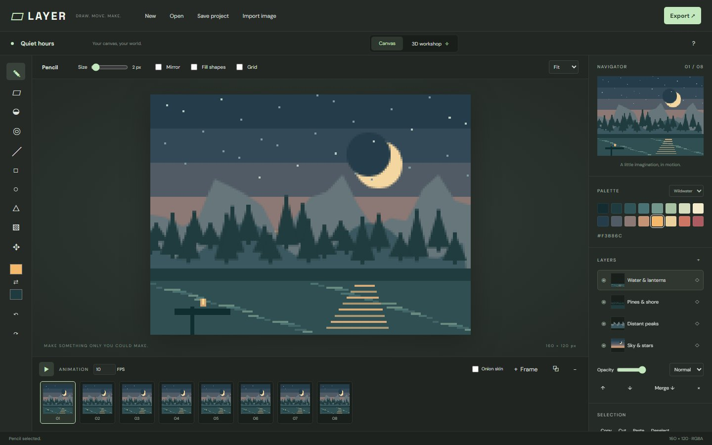

# Verification — 2026-09-28

- Production build succeeds. Three.js workshop is a separate lazy-loaded chunk.
- Three Node tests pass: connected/alpha-aware fill boundaries, line rasterization in all directions, malformed/oversized project rejection.
- Real Chromium on Windows verified exact canvas pixels after drawing, undo and redo; layer reorder; frame duplication; GIF signature; sprite-sheet PNG dimensions; project download/open round trip; Three.js rendering and GLB signature.
- Desktop screenshot reviewed at 1440 × 900; touch layout reviewed at 390 × 844. Inspector opening, adding layers and drawing were exercised with touch input.
- No page or renderer errors recorded during the passing browser run.

Physical iPhone Safari, full-color animated GIF visual fidelity across third-party players and downstream engine GLB import were not exercised. A GLB export is a static mesh; animation playback updates its texture in the workshop but GLB does not embed the flipbook. Height relief derives depth from brightness; it does not reconstruct hidden object surfaces.

